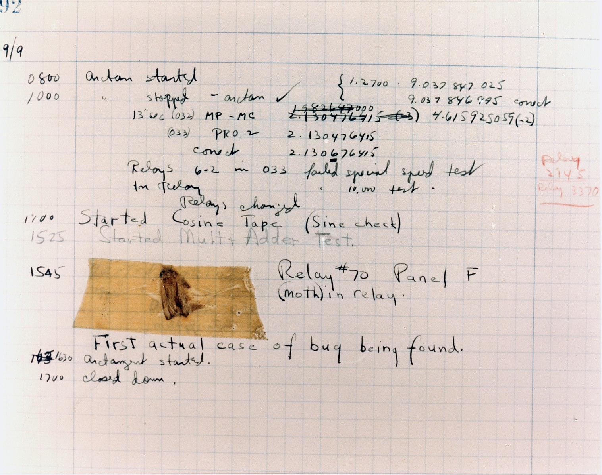

# What the test

A basic code repo to demonstrate what is under the hood of test frameworks.

# Objective

Try to break the barriers of testing.

# Agenda

1. Try to understand what is a test.
2. What are bugs
   1. 
3. Building a test framework
   1. what is under the hood

# What's Next?

1. Learn about testing frameworks
   1. [Jest](https://jestjs.io/)
   2. [Mocha](https://mochajs.org/)
   3. [Jasmine](https://jasmine.github.io/)
   4. [Protractor](https://www.protractortest.org/#/)

# Feedback

https://forms.gle/BLpKNYARXnYRUpkCA
